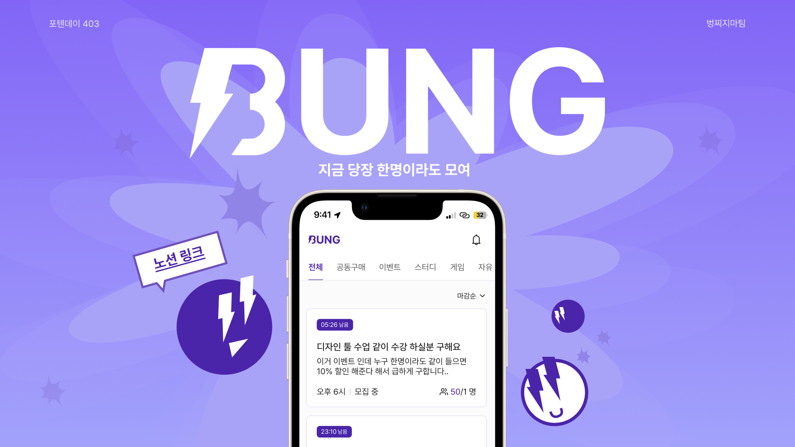
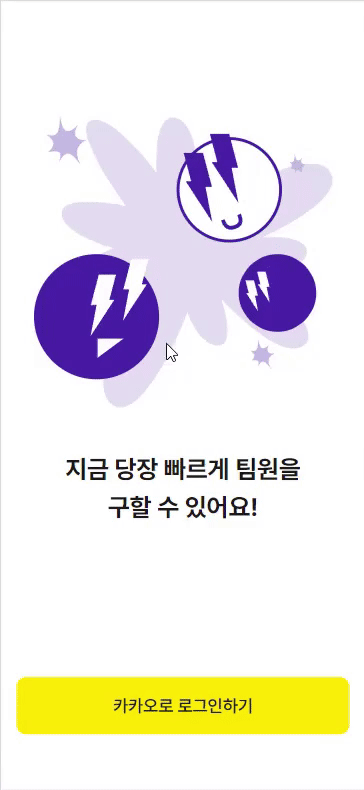
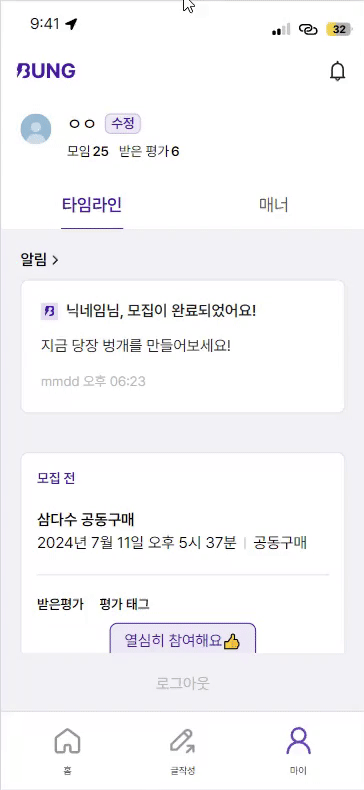
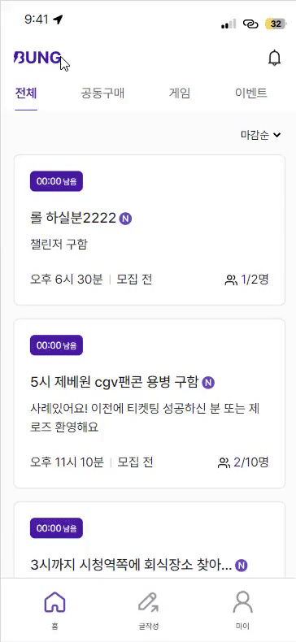
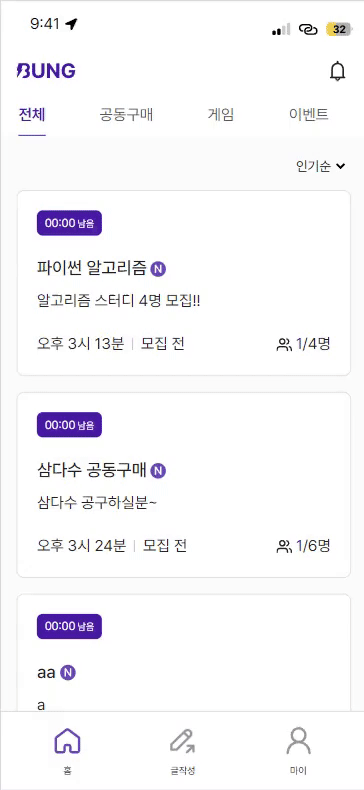
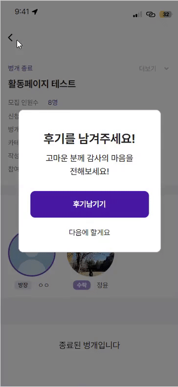
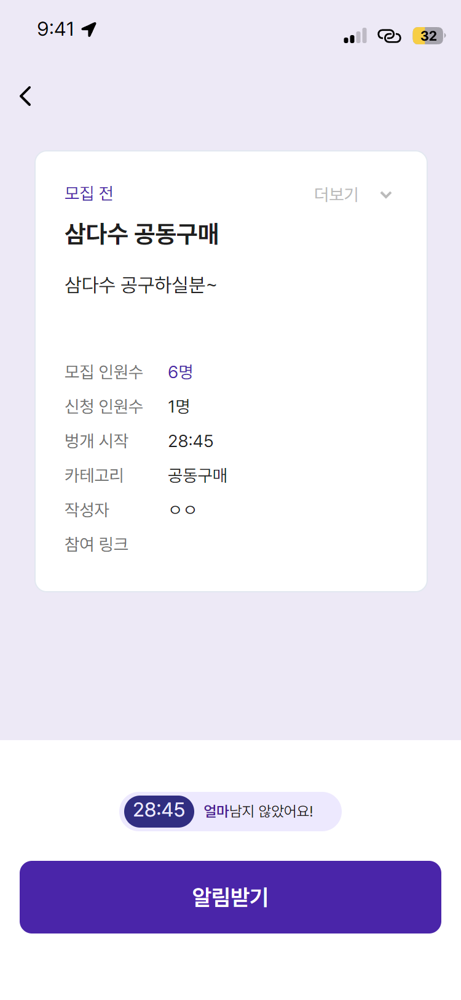
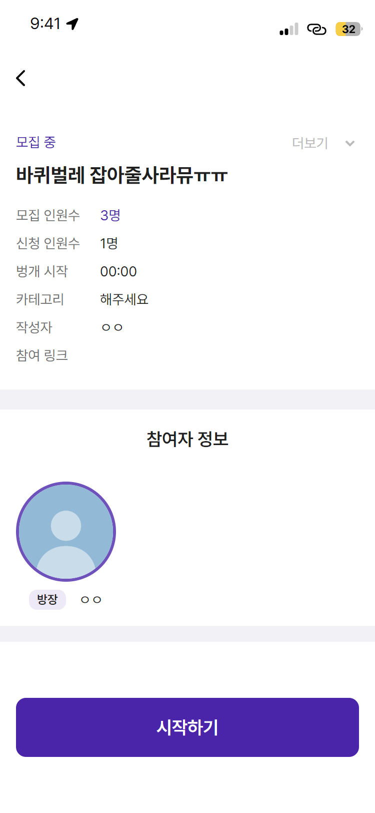
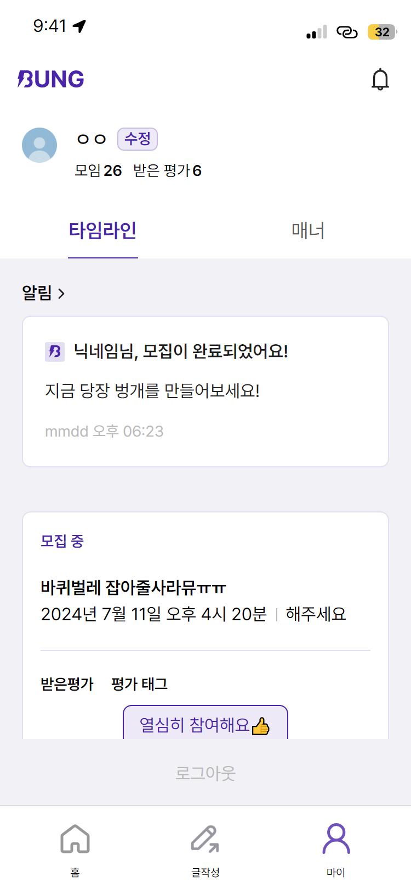
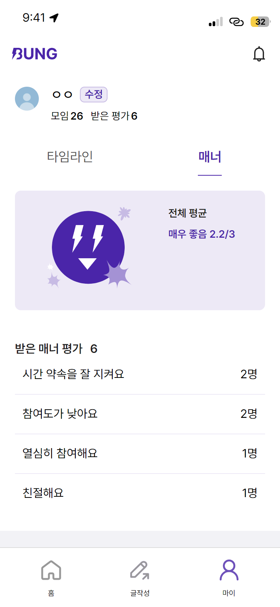

#### [403 포텐데이 프로젝트](https://bside.best/projects/detail/P240320221513)

## 30분 안에 시작하는 벙개모임, 벙 (BUNG)

벙은 30분 안에 무언가를 같이 할 사람을 바로 구할 수 있는 대학생 커뮤니티로, 게임, 공구 등 지금 무언가를 같이 할 팀원들을 빠르게 찾을 수 있어요.

## ✨주요 기능

|  |  |  |
| :---------------------------: | :-------------------------: | :---------------------------------: |
|            로그인             |         메인페이지          |             닉네임 변경             |

|  |  |  |
| :---------------------------: | :-----------------------------: | :-----------------------------: |
|            글작성             |          글수정 / 삭제          |            후기 작성            |

|  |  |  |  |
| :-----------------------------: | :---------------------------------: | :---------------------------------: | :-----------------------------: |
|           상세페이지            |             활동페이지              |        마이페이지 - 타임라인        |        마이페이지 - 매너        |

## 🛠 기술 스택

  

